**(2013 - Graduation, 4th Year, Major Project)**

# Compiler Automation Tool (2013)

Compiler Automation Tool (CAT) is a java based application, a tool for automating the task of compilation process. 
With CAT, one can design compiler for any language using user-friendly graphical interface 
by specifying **regular expressions**, **transition diagram**, **context free grammar** and various compiler 
specifications to generate a compiler model. This model is then used to compile a source code displaying 
intermediate processing results during each phase such as stream of tokens generated by **lexical phase**, 
**parsing decisions** etc. Such a tool provides the designer/researchers/learners a bright light over the language 
being designed and help them to make strategy on how the compilation process takes place. CAT is compiler field specific tool and is useful for anyone related to compiler design, development as well as learning.

CAT uses a three phase strategy. The complete project is divided into three separate but related applications:

1. **'CAT Modeler':** covers all the specification regarding a compiler construction such as lexical, syntax, 
semantic etc. Using ‘CAT Modeler’, the user models the programming language by specifying various regular expressions, 
transition diagrams, context free grammar, syntax directed translation schemes etc to build a compiler model. 
Using these specifications, CAT Modeler generates Parse tree, Non Deterministic finite automata, 
Deterministic finite automata, syntax tree etc and provide simulation facility to test various codes. 
In the end it produces a model file of extension .mdc which in turn will be used for compiling source code.

2. **'CAT Compiler':** uses the model file as generated by CAT Modeler as well as source code and compiles it according 
to the specifications, performing all compilation phases and displaying results. This gives user an idea about how 
the compilation decisions were made. Besides, the user can also choose to keep the track of the performance of the 
code being complied on basis various stats and use 'CAT Statistic Studio' for analysis.

3. **'The CAT Statistic Studio'**: obtains the performance record as gathered by CAT Compiler and processes it to 
generate statistic information regarding the efficiency of the model. The gathered data can used to plot graphs to 
represent the data graphically and analyse the behavior of the model which can saved for later use or to generate a 
PDF report.

#### Compiler Phases Implemented:

- **Lexical Analysis:** Keywords, Regular expressions, Transition diagrams, Non Deterministic finite automata, Deterministic finite automata

    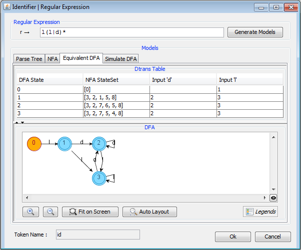
    
- **Syntax Analysis:** Grammer, Normalization, First and Follow, LL(1), SLR, CLR, LALR

    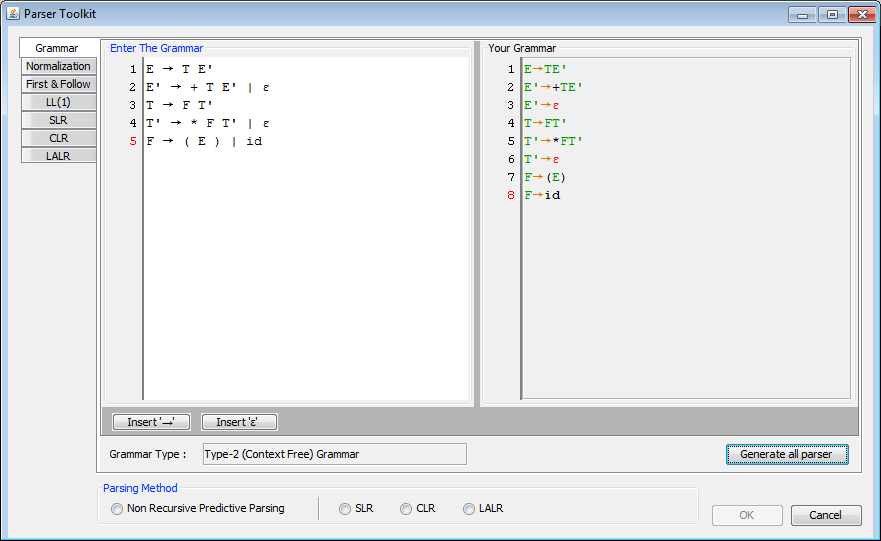
    
    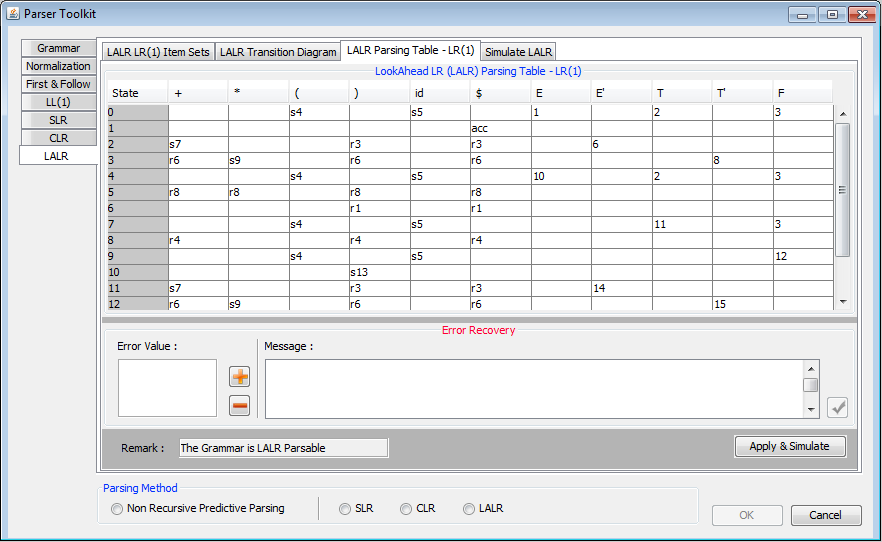
    

#### Programming Language:

The project has been build in **Java (Java SE Develeopment Kit 6)** programming language using **NetBeans IDE 7.2.1**.

## Declaration

All work presented in the project entitled “Compiler Automation Tool” has been submitted in the partial fulfillment of the requirements for the award of the degree of Bachelor of Technology in Computer Science & Engineering, Guru Tegh Bahadur Institute of Technology, affiliated to Guru Gobind Singh Indraprastha University, New Delhi, India. This is an authentic record of our own work carried out under the guidance of our mentor Ms. Rekha Bhatia.

#### Team Members:
- Gagandeep Singh
- Hargeet Kaur
- Amarpreet Singh
- Harpreet Kaur

## Target Audience

- **Students**: CAT is a perfect lab tool for students studying compiler construction. They can experiment on it with their own choice of regular expresion, grammer etc.
- **Lecturers**: Useful for teachers or Lecturer for teaching students
- **Researchers**: Can be used be researchers engaged in compiler construction to quickly conclude their decisions.

## Thesis
Click [here](_Publish/Thesis_CompilerAutomationTool_2013.pdf) to download thesis for the project.

Click [here](_Publish/PPT_CompilerAutomationTool.pdf) to download Power-Point presentation.

## Screenshots

**CAT Modeler**

|    |   |
|---|---|
| 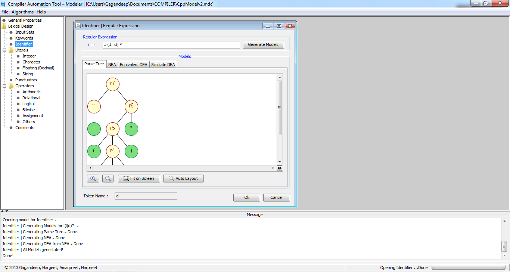   | 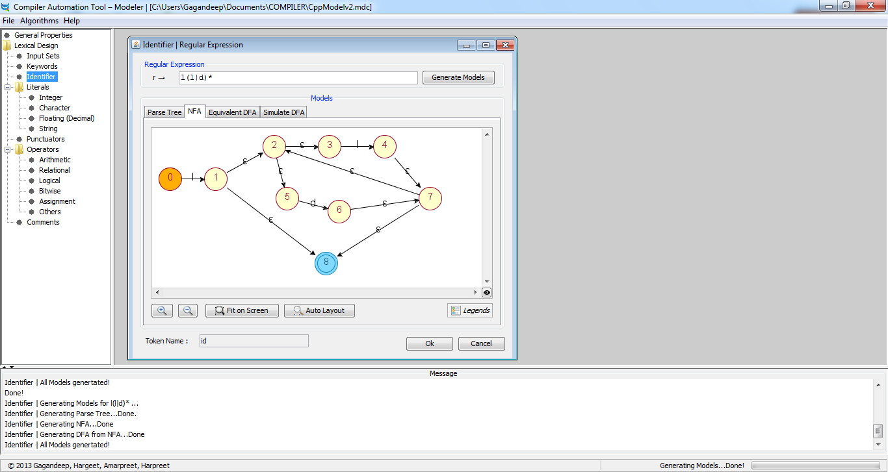  |
| 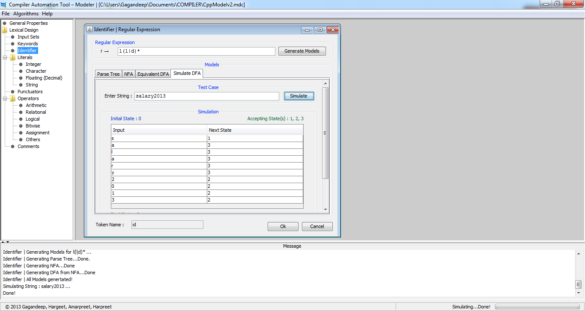  | 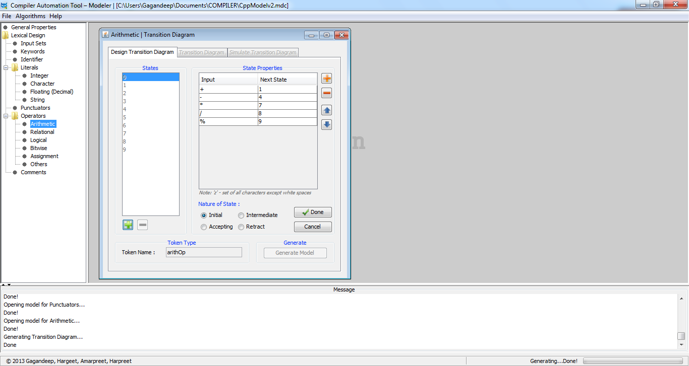  |
| 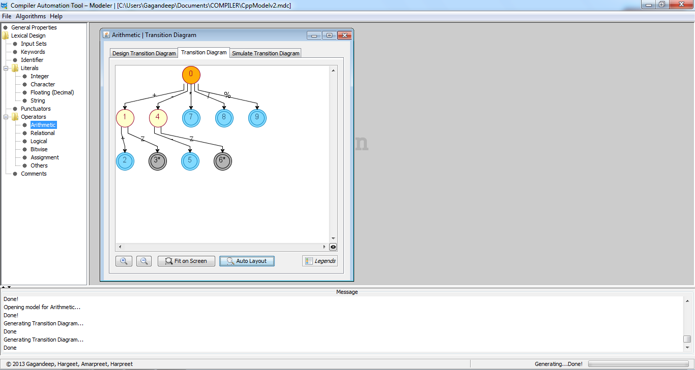  | 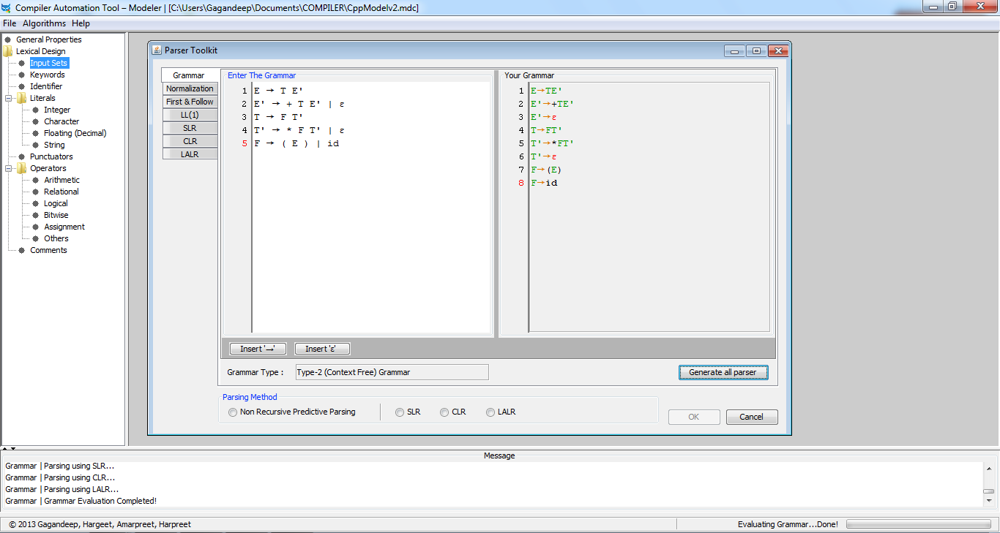  |
| 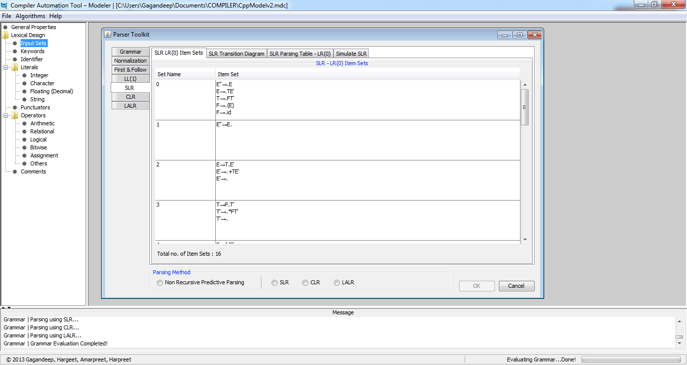  | 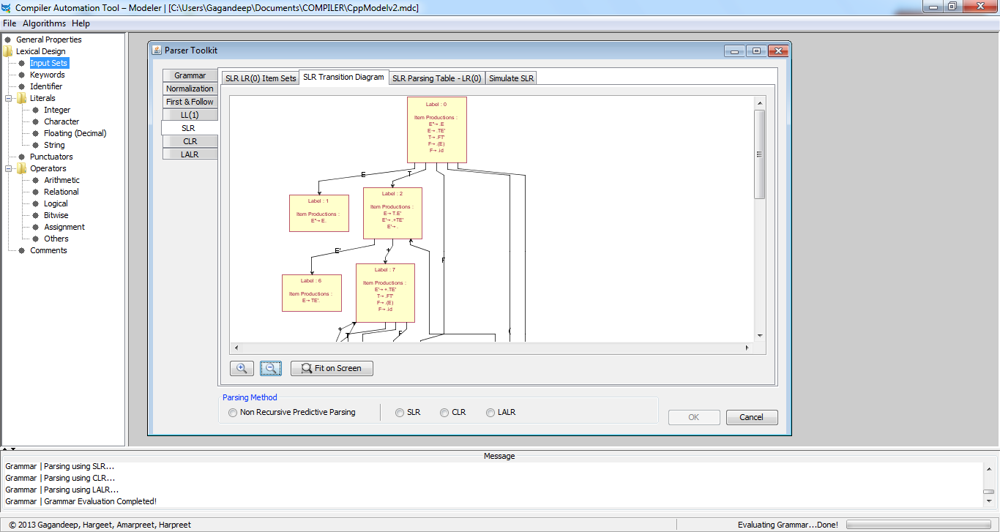  |
| 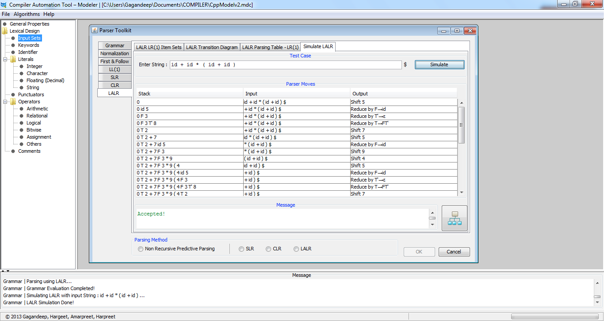  | 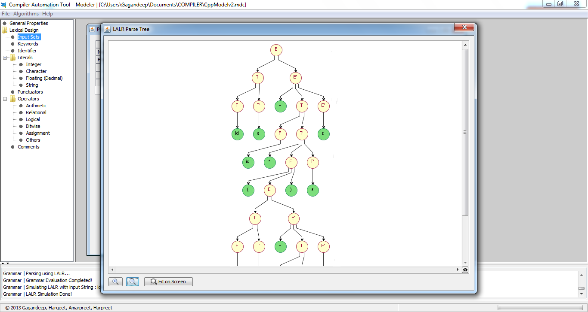  |

**CAT Compiler**

|    |   |
|---|---|
| 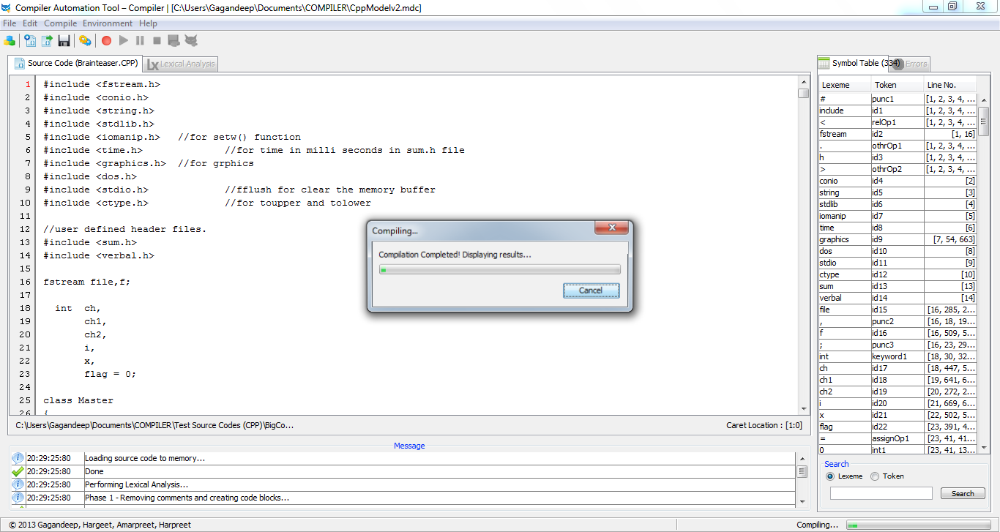   | 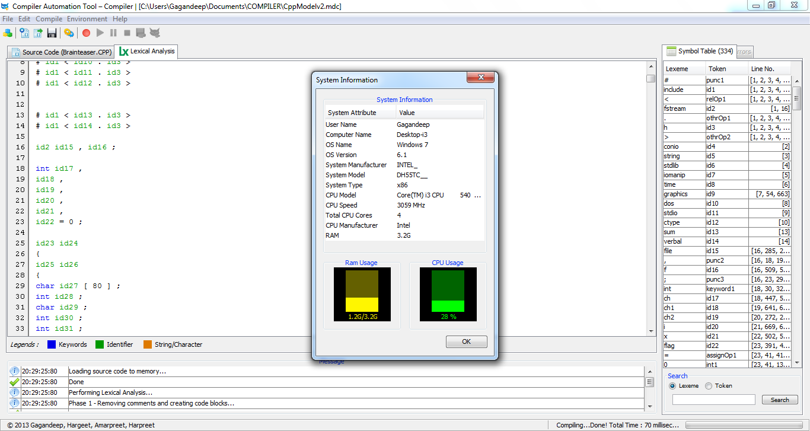  |

**CAT Statistic Studio**

|    |   |
|---|---|
| 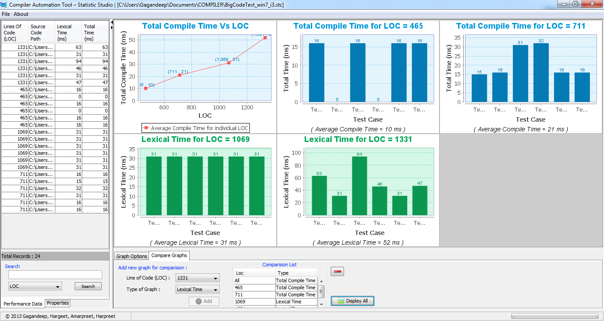   | 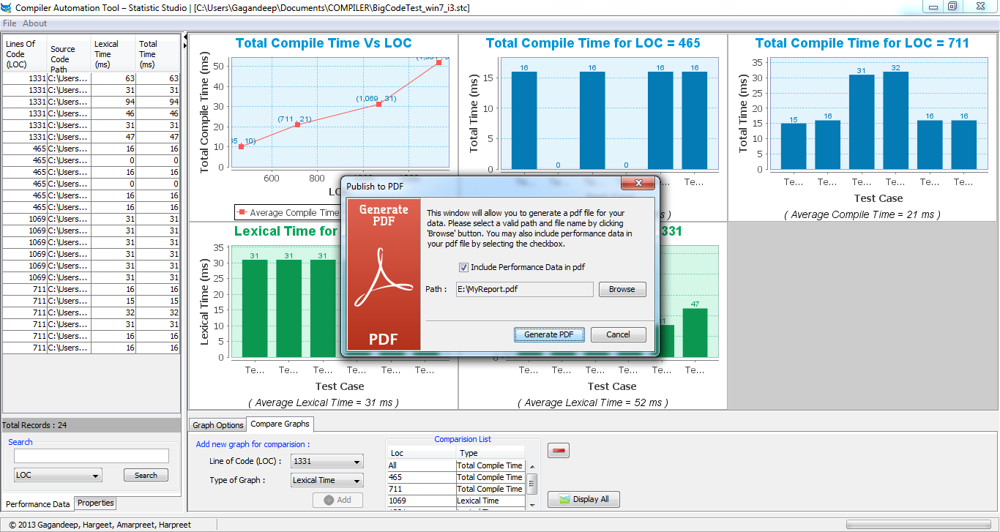  |

Sample PDF Report: [Download](_Publish/Sample_PDF_Report.pdf)

## Limitations

Following are the limitations of the project:

- CAT captures only general features of the language under consideration. There are certain specific features related to the languages that are difficult to model or perhaps CAT does not provide any way of modeling them.
- There exist certain limitations with respect to CAT Modeler. These are as follows:
    - Regular expressions does not take into account ‘?’ (zero or one instance). Expressions using ‘?’ have to be expanded using ‘|’. This increases the length and complexity of the expression.
    - Limited set space is available. User can use maximum of 25 (a-y) set.
    - Wastage of set space when specifying single character. For instance, when specifying quote in regular expression, user must first define a set containing only quote character. This causes wastage of limited set space.
    - Difficult to model operator whose nature depends upon the operands. For example, ‘>>’ operator is regarded as shift operator as well as extraction operator in C++.
    - Does not allow multiple line strings. These are considered as errors later by CAT Compiler.
    - There is nearly no way for CAT to identify Ambiguous grammar entered by the user. Thus, the user must be very careful while entering grammar.
- CAT Compiler may take time to load long codes.
- Only Lexical and Syntax phases have been developed yet.

## How to run

- Download and extract [Disk_CompilerAutomationTool.zip](_Publish/Disk_CompilerAutomationTool.zip) from [_Publish/](_Publish) directory.
- Run 'Setup.exe' and follow the instructions to install.
- From installed directory run:
    - 'CATCompiler.exe' to launch Compiler
    - 'CATModeler.exe' to launch Modeler.
    - 'CATStatisticStudio.exe' to launch Statistics Studio.

## References

- Alfred V. Aho , Ravi Sethi, Jeffrey D. Ullman, “Compilers Principles, Techniques and Tools”, Pearson Education Asia , 2002.
- “Compiler Construction/Dealing with errors”, http://en.wikibooks.org/wiki/Compiler_Construction/Dealing_with_errors
- “Phase 1: Lexical Analysis”, http://www.eecg.toronto.edu/~csc467/project/phase1.html
- “Error Handling”, http://www.cs.vassar.edu/~cs331/lexical-analyzer/error.html
- “Compiler Errors”, http://bcook.cs.georgiasouthern.edu/windowsce/cpp3.htm
- “Context-free grammar”, http://en.wikipedia.org/wiki/Context-free_grammar
- “How to left factor a context-free grammar?”, http://stackoverflow.com/questions/9540117/how-to-left-factor-a-context-free-grammar
- “Program to compute first and follow of a grammar?”, http://wiki.answers.com/Q/Program_to_compute_first_and_follow_of_a_grammar
- “Parsing Algorithm”, http://cs.nyu.edu/courses/spring01/V22.0480-002/parse.html
- “Lexical and Syntax Analysis of Programming Languages”, http://www.pling.org.uk/cs/lsa.html
- “SLR(1), LR(1) and LALR(1) Grammars”, http://lambda.uta.edu/cse5317/notes/node20.html
- “SLR Parse table in JFlap”, http://www.jflap.org/tutorial/grammar/slr/index.html
- “LR parser”, http://en.wikipedia.org/wiki/LR_parser
- “How is the following grammar LR(1) but not SLR(1)”, http://stackoverflow.com/questions/10505717/how-is-the-following-grammar-lr1-but-not-slr1
- “Formal Languages and Grammer”, http://www.cse.ohio-state.edu/~gurari/theory-bk/theory-bk-onese2.html
- “Left Recursion and Left Factoring”, http://cs.stackexchange.com/questions/2696/left-recursion-and-left-factoring-which-one-goes-first
- “Left Factoring”, http://code.google.com/p/blacc/wiki/DesignCommonLeft

